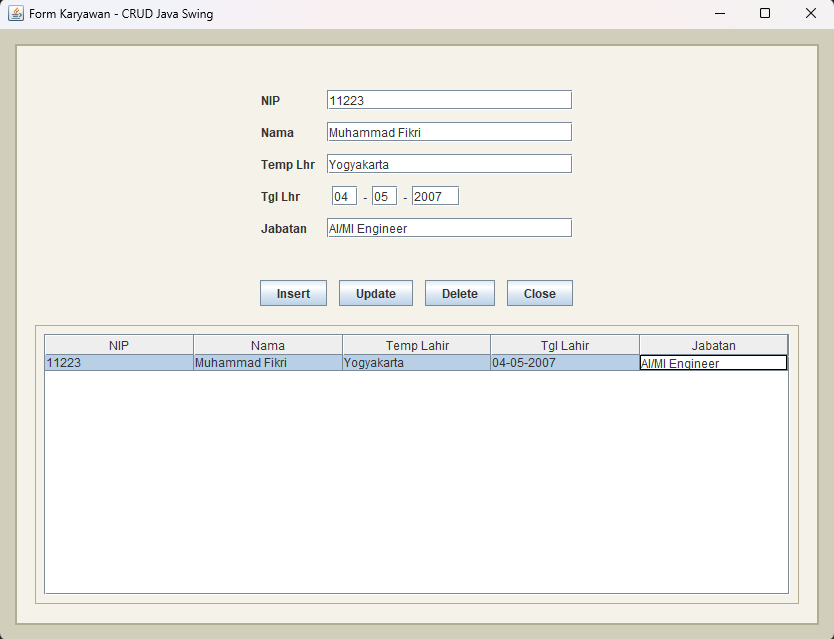

# DatabaseJava_MuhammadFikri_I.2510162

## 👤 Identitas
- **Nama**: Muhammad Fikri  
- **NIM**: I.1510162  

---

## 📖 Deskripsi Proyek
Proyek ini merupakan implementasi **CRUD (Create, Read, Update, Delete)** menggunakan **Java Swing** dengan integrasi **MySQL Database**.  
Tujuan utama dari aplikasi ini adalah:
- Membuat antarmuka GUI yang interaktif untuk pengelolaan data.
- Menghubungkan aplikasi desktop dengan database MySQL.
- Melatih konsep **Object-Oriented Programming (OOP)** dalam pengembangan aplikasi nyata.

---

## ⚙️ Fitur Utama
- **Tambah Data**: Form input dengan validasi.
- **Lihat Data**: Tabel interaktif dengan refresh otomatis.
- **Edit Data**: Update record langsung dari GUI.
- **Hapus Data**: Delete record dengan konfirmasi.
- **Koneksi Database**: Menggunakan JDBC untuk integrasi MySQL.

---

## 🛠️ Teknologi yang Digunakan
- **Java** (JDK 17)
- **Java Swing** (GUI)
- **MySQL** (Database)
- **Maven** (Project Management)
